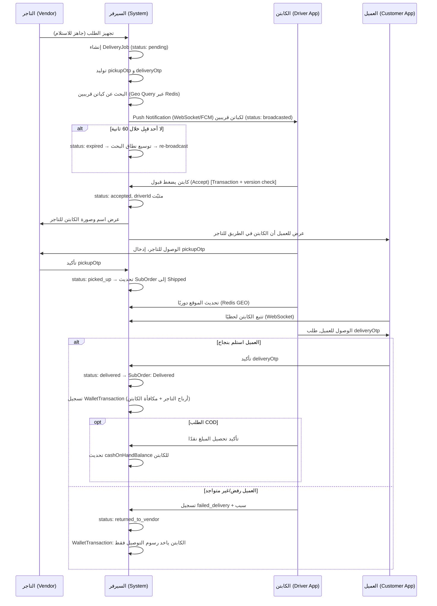

# خطة تصميم وتطوير نظام التوصيل (Delivery System Architecture) — النسخة المعدّلة v2 🚚

هذه نسخة معدّلة من الخطة الأصلية، تم فيها إغلاق الثغرات في الـ Workflow، وتقوية الأمان، وحل مشاكل الأداء المتوقعة عند التوسّع (Scale).

---

## 1. نموذج التوصيل (Point-to-Point SubOrder Delivery)

يبقى المبدأ الأساسي كما هو لأنه الأنسب لنظام Multi-Vendor:

> يتم تعيين الكابتن لتوصيل **الطلب الفرعي (`SubOrder`)** الخاص بتاجر واحد، وليس الطلب الرئيسي بالكامل. في حال وجود عدة تجار في نفس الطلب، يتم إنشاء `DeliveryJob` مستقل لكل `SubOrder`.

**إضافة مهمة:** كل `DeliveryJob` يحمل بيانات **الوزن/الحجم التقريبي** حتى يقوم النظام تلقائيًا بفلترة الكباتن المناسبين (مثلاً: لا تُعرض شحنة "دفربوكس" ثقيلة على كابتن موتوسيكل).

---

## 2. الهيكلة وتعديلات قاعدة البيانات (Database Schema)

### أ. تعديل أدوار المستخدمين
إضافة دور `driver` إلى جدول `UserRole`.

### ب. جدول المندوبين (`DeliveryDriver`)

| الحقل | الوصف |
|---|---|
| `id` | المعرف الخاص به |
| `userId` | مرتبط بجدول المستخدمين |
| `vehicleType` | موتوسيكل / سيارة / ربع نقل |
| `maxWeightCapacityKg` | **[جديد]** أقصى وزن يقدر يحمله، يُستخدم للفلترة التلقائية |
| `status` | `online` / `offline` / `busy` **[معدّل: أضفنا busy]** |
| `currentLat`, `currentLng` | **[معدّل]** بدلاً من JSON، حقول منفصلة + فهرسة جغرافية (انظر البند 6) |
| `walletBalance` | الرصيد الحالي (محسوب/Cache، وليس مصدر الحقيقة — انظر جدول `WalletTransaction`) |
| `cashOnHandBalance` | **[جديد]** إجمالي مبالغ الـ COD المحصّلة وغير المسوّاة بعد |
| `cashLimit` | **[جديد]** الحد الأقصى المسموح به قبل إيقاف تعيين طلبات COD جديدة له |
| `rating` | **[جديد]** متوسط تقييم العميل للكابتن |
| `isVerified` | **[جديد]** هل تم التحقق من هويته/رخصته |

### ج. جدول مهام التوصيل (`DeliveryJob`) — معدّل بالكامل

| الحقل | الوصف |
|---|---|
| `id` | المعرف |
| `subOrderId` | مربوط بالطلب الفرعي |
| `driverId` | (nullable) الكابتن الذي وافق |
| `status` | انظر الـ State Machine الكاملة في البند 3 |
| `deliveryFee` | إجمالي رسوم التوصيل المدفوعة من العميل |
| `driverEarning` | **[جديد]** ما يحصل عليه الكابتن فعليًا (بعد خصم عمولة المنصة) |
| `platformCommissionAmount` | **[جديد]** حصة المنصة من رسوم التوصيل |
| `distanceKm` | **[جديد]** المسافة المحسوبة وقت الإنشاء (لأغراض التسعير والتدقيق) |
| `pickupAddress`, `dropoffAddress` | عناوين نصية |
| `pickupLat/Lng`, `dropoffLat/Lng` | **[جديد]** إحداثيات دقيقة للتتبع والـ routing |
| `pickupOtp` | **[جديد]** كود تحقق 4 أرقام يظهر عند التاجر |
| `deliveryOtp` | **[جديد]** كود تحقق 4 أرقام يظهر عند العميل |
| `isCod` | **[جديد]** هل الطلب دفع عند الاستلام |
| `codAmountToCollect` | **[جديد]** المبلغ الكامل (ثمن القطعة + رسوم التوصيل لو مطلوب) |
| `assignmentAttempt` | **[جديد]** رقم المحاولة (لتتبع كم كابتن رفض/انتهت مهلته قبل القبول) |
| `acceptedAt`, `pickedUpAt`, `deliveredAt`, `cancelledAt` | **[جديد]** توقيتات لكل مرحلة (للتقارير والـ SLA) |
| `cancellationReason` | **[جديد]** |
| `version` | **[جديد]** لحل مشكلة الـ Race Condition (Optimistic Locking) |

### د. جدول سجل المحفظة (`WalletTransaction`) — **جديد بالكامل**

هذا الجدول ضروري ولا يجب الاستغناء عنه بحقل `walletBalance` وحده، لأنه يوفر **سجل تدقيق (Audit Trail)** كامل:

| الحقل | الوصف |
|---|---|
| `id` | المعرف |
| `walletOwnerType` | `driver` / `vendor` / `platform` |
| `walletOwnerId` | معرف صاحب المحفظة |
| `type` | `credit` (إيداع) / `debit` (سحب) / `cod_collected` / `cod_settled` |
| `amount` | المبلغ |
| `relatedDeliveryJobId` | (nullable) الطلب المرتبط |
| `balanceAfter` | الرصيد بعد العملية (Snapshot) |
| `createdAt` | التوقيت |

> **القاعدة الذهبية:** `walletBalance` في جدول `DeliveryDriver` هو دائمًا **Cache محسوب** من مجموع `WalletTransaction`، وليس مصدر الحقيقة الوحيد. أي عملية مالية تمر عبر Transaction في القاعدة تُحدّث الاثنين معًا.

### هـ. جدول تقييمات التوصيل (`DeliveryRating`) — **جديد**
لتقييم العميل للكابتن بعد كل عملية توصيل (نجوم + تعليق اختياري)، يُستخدم لاحقًا لحساب `rating` وربما لإيقاف كباتن ضعيفي الأداء.

---

## 3. دورة حياة الطلب (Workflow) — الحالات الكاملة

### State Machine لحالة `DeliveryJob`

```
pending ──► broadcasted ──► accepted ──► picked_up ──► on_the_way ──► delivered
   │              │             │                                        
   │              │             └──► cancelled (من التاجر/العميل قبل الاستلام)
   │              │
   │              └──► expired (لا كابتن قبل خلال المهلة) ──► re-broadcast تلقائي
   │
   └──► cancelled (قبل حتى البحث عن كابتن)

picked_up / on_the_way ──► failed_delivery (العميل رفض الاستلام، خصوصًا مهم في COD)
                                  │
                                  └──► returned_to_vendor
```

### شرح الحالات الجديدة المضافة:

- **`broadcasted`**: تم إرسال الطلب لمجموعة كباتن قريبين، في انتظار قبول أحدهم.
- **`expired`**: لو محدش قبِل خلال مهلة زمنية (مثلاً 60 ثانية)، النظام يزيد `assignmentAttempt`، ويوسّع دائرة البحث (radius) تلقائيًا، ويعيد الـ broadcast لكباتن جدد.
- **`cancelled`**: بسبب من التاجر أو العميل، مع تسجيل `cancellationReason`.
- **`failed_delivery`**: العميل رفض الاستلام أو لم يكن متواجدًا — يُفتح مسار **إرجاع للتاجر** (`returned_to_vendor`) مع تسوية مالية مختلفة (الكابتن ياخد رسوم التوصيل كاملة لأنه بذل المجهود، لكن العميل ما يُحمّلش قيمة القطعة).

### Sequence Diagram المعدّل



---

## 4. التحقق والأمان (Security)

1. **OTP للاستلام والتسليم**: كما وضح أعلاه، `pickupOtp` و `deliveryOtp` يمنعان تسليم/استلام القطعة للشخص الغلط.
2. **Optimistic Locking عند القبول**: عند استدعاء `/accept`، يتم التحقق من أن `status = broadcasted` و `version` لم تتغير ضمن نفس الـ DB Transaction، وإلا يُرفض الطلب برسالة "تم قبول الطلب من كابتن آخر بالفعل". هذا يمنع تعيين كابتنين لنفس المهمة.
3. **التحقق من هوية الكابتن**: حقل `isVerified` — لا يُسمح بالظهور في نتائج البحث إلا بعد اعتماد المستندات (رخصة، بطاقة شخصية).
4. **حد أقصى للـ COD (`cashLimit`)**: لو `cashOnHandBalance` للكابتن تخطى `cashLimit`، يُستبعد تلقائيًا من عرض طلبات COD جديدة إلى أن يسوّي حسابه مع المنصة (تحويل بنكي/تسليم نقدي في المكتب).

---

## 5. التسعير (Pricing) — الرد على السؤال المفتوح

**التوصية: تسعير ديناميكي بالمسافة + حد أدنى ثابت**، بدلاً من التسعير الثابت حسب المحافظة:

```
deliveryFee = baseFee + (distanceKm × perKmRate)
```

- `baseFee`: رسوم أساسية ثابتة (تغطي أول 2-3 كم مثلاً).
- `perKmRate`: قابل للتعديل من لوحة التحكم، ويمكن أن يختلف حسب `vehicleType` (سيارة/ربع نقل أغلى من موتوسيكل لثقل قطع الغيار).
- المسافة تُحسب عبر **Google Maps Distance Matrix API** أو **OSRM** (بديل مجاني/مفتوح المصدر لتقليل التكلفة عند الحجم الكبير).
- `platformCommissionAmount` تُخصم كنسبة مئوية من `deliveryFee` (مثلاً 15-20%) وتُحفظ في `WalletTransaction` الخاصة بالمنصة.

> يُنصح أيضًا بإضافة **Surge Pricing** بسيط لاحقًا (وقت الذروة/الطقس السيء) — لكن ممكن تأجيله لمرحلة تالية بعد الإطلاق.

---

## 6. البنية التحتية للموقع اللحظي (Location Tracking at Scale)

المشكلة: تحديث موقع كل كابتن كل بضع ثوانٍ + البحث عن "أقرب كابتن" مباشرة على قاعدة البيانات الرئيسية (PostgreSQL/MySQL) سيصبح عنق زجاجة (Bottleneck) مع نمو عدد الكباتن.

**الحل المعدّل:**
- استخدام **Redis** مع بنية `GEOADD` / `GEORADIUS` لتخزين المواقع اللحظية للكباتن المتصلين (`online`).
- الجدول الأساسي (`DeliveryDriver.currentLat/Lng`) يُحدَّث فقط دوريًا (كل دقيقة مثلاً) أو عند تغيّر حالة المهمة (`picked_up`, `delivered`) — وليس عند كل نبضة GPS.
- البحث عن الكباتن القريبين لـ `broadcast` يتم بالكامل عبر استعلام Redis GEO (أداء أسرع بمراتب من استعلام SQL جغرافي مباشر).
- بديل بسيط في مرحلة الـ MVP: لو الفريق التقني صغير، يمكن البدء بـ **PostGIS extension** على PostgreSQL مباشرة، والانتقال لـ Redis لاحقًا عند الحاجة الفعلية للتوسّع.

---

## 7. الاتصال اللحظي (Real-time Communication)

الاعتماد فقط على REST APIs مع Polling غير كافٍ ويستهلك بطارية وموارد سيرفر. **يجب إضافة:**

- **WebSocket** (Socket.io أو Pusher أو Ably) لـ:
  - بث موقع الكابتن لحظيًا لتطبيق العميل.
  - إشعار الكباتن بطلبات جديدة قريبة منهم فورًا.
- **Push Notifications (FCM/APNs)** كنسخة احتياطية (fallback) في حال التطبيق مغلق بالكامل (Background/Killed state).

---

## 8. الواجهات البرمجية (APIs) — محدّثة

### تطبيق الكابتن (Driver App)
| Endpoint | الوصف |
|---|---|
| `POST /api/driver/location` | تحديث الموقع (يُكتب في Redis مباشرة) |
| `GET /api/driver/jobs/available` | الطلبات القريبة (بعد فلترة الوزن ونوع المركبة) |
| `POST /api/driver/jobs/:id/accept` | قبول الطلب (مع Optimistic Locking) |
| `POST /api/driver/jobs/:id/reject` | **[جديد]** رفض صريح (يُسرّع إعادة التعيين بدل انتظار انتهاء المهلة) |
| `POST /api/driver/jobs/:id/verify-pickup-otp` | **[جديد]** تأكيد استلام القطعة من التاجر |
| `POST /api/driver/jobs/:id/verify-delivery-otp` | **[جديد]** تأكيد التسليم للعميل |
| `POST /api/driver/jobs/:id/report-failed-delivery` | **[جديد]** تسجيل فشل التسليم مع السبب |
| `POST /api/driver/jobs/:id/confirm-cod-collected` | **[جديد]** تأكيد تحصيل مبلغ COD |
| `GET /api/driver/wallet/transactions` | **[جديد]** كشف حساب الكابتن |
| `POST /api/driver/wallet/request-settlement` | **[جديد]** طلب تسوية رصيد الـ COD المتراكم |

### تطبيق العميل (Customer App) — إضافات
| Endpoint | الوصف |
|---|---|
| `GET /api/orders/:subOrderId/tracking` | **[جديد]** موقع الكابتن اللحظي + الحالة (عبر WebSocket بشكل أساسي، وREST كـ fallback) |
| `POST /api/orders/:subOrderId/rate-driver` | **[جديد]** تقييم الكابتن بعد التسليم |

### لوحة تحكم الإدارة (Admin) — إضافات
| Endpoint | الوصف |
|---|---|
| `GET /api/admin/drivers/pending-verification` | **[جديد]** مراجعة طلبات توثيق الكباتن |
| `GET /api/admin/cod/pending-settlements` | **[جديد]** متابعة أرصدة الـ COD غير المسوّاة |
| `PATCH /api/admin/pricing/rules` | **[جديد]** تعديل `baseFee` و `perKmRate` |

---

## 9. ملخص التعديلات الرئيسية عن النسخة الأولى

| # | التعديل | السبب |
|---|---|---|
| 1 | إضافة حالات `expired`, `rejected`, `cancelled`, `failed_delivery` | التعامل مع سيناريوهات الفشل الواقعية |
| 2 | `pickupOtp` / `deliveryOtp` | منع التسليم/الاستلام الخاطئ |
| 3 | `version` field + Optimistic Locking | منع Race Condition عند قبول الطلب |
| 4 | جدول `WalletTransaction` منفصل | سجل تدقيق مالي كامل (Audit Trail) |
| 5 | `cashOnHandBalance` + `cashLimit` | إدارة مخاطر الدفع عند الاستلام |
| 6 | `maxWeightCapacityKg` + بيانات وزن الشحنة | فلترة تلقائية للكباتن المناسبين |
| 7 | Redis GEO للموقع اللحظي | حل مشكلة الأداء عند التوسّع |
| 8 | WebSocket + Push Notifications | تتبّع وإشعارات حقيقية بدل REST Polling |
| 9 | تسعير ديناميكي بالمسافة | عدالة أكبر في التسعير من الثابت بالمحافظة |
| 10 | `platformCommissionAmount` | وضوح في احتساب عمولة المنصة |

---

## User Review Required

> [!IMPORTANT]
> **نسبة عمولة المنصة على رسوم التوصيل:** كم النسبة المقترحة؟ (مثال: 15%، 20%)

> [!IMPORTANT]
> **مزود خرائط المسافة:** هل نعتمد Google Maps Distance Matrix (دقة أعلى، تكلفة لكل استعلام) أم OSRM مفتوح المصدر (مجاني، يحتاج استضافة)؟

> [!WARNING]
> **حد الـ Cash Limit للكباتن:** ما القيمة المناسبة قبل إيقاف تعيين طلبات COD جديدة؟ (مثال: 500 - 1000 جنيه)

## Open Questions
- هل تفضّل البدء بـ **PostGIS** كحل أبسط للـ MVP، أم الاستثمار مباشرة في **Redis GEO** من البداية؟
- هل تطبيق الكابتن سيدعم أكثر من مهمة توصيل متزامنة (Batching) أم مهمة واحدة فقط في كل وقت في المرحلة الأولى؟

إذا كانت هذه الخطة المعدّلة متوافقة مع رؤيتك، يرجى الضغط على **Proceed** لنبدأ في تجهيز الـ Database Schema والـ APIs الفعلية.
